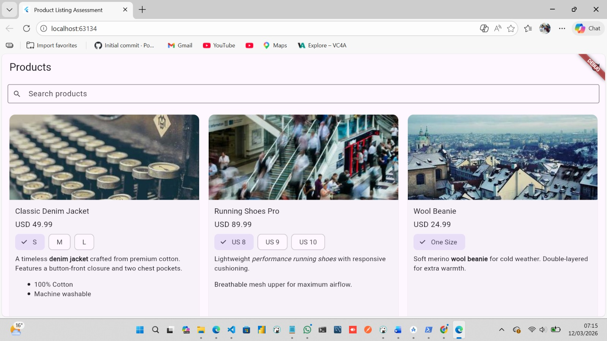

# Product Listing Assessment

**[View Live App - https://fluuter-web-test.netlify.app/](https://fluuter-web-test.netlify.app/)**

This is the **implementation** of the WINP Flux Product Listing assessment.

### Test Result
```
 57 tests passed
   ├── 47 original provided tests
   ├── 8 new HtmlContentService unit tests
   └── 2 additional test instances
```

---

## Screenshots

### Product Listing Page


### Search & Filter in Action


### Favorites Feature


### Sort Control


### Responsive Design - Mobile


---

## Project Structure

```
assessment/
├── assets/
│   └── products.json                   # Local mock product data
├── lib/
│   ├── main.dart                       # App entry point with Material theme
│   ├── router.dart                     # Go Router configuration
│   ├── di/
│   │   └── service_locator.dart        # GetIt dependency injection setup
│   ├── models/
│   │   └── product_model.dart          # ProductModel & VariantModel classes
│   ├── services/
│   │   ├── product_service.dart        # Loads product data from JSON
│   │   └── html_content_service.dart   # HTML parsing utilities
│   ├── providers/
│   │   └── product_list_provider.dart  # ChangeNotifier state management
│   ├── screens/
│   │   └── product_list_screen.dart    # Main screen with provider integration
│   └── widgets/
│       ├── product_card.dart           # Product display card with favorites
│       └── responsive_layout.dart      # Responsive layout system
├── test/
│   ├── product_list_provider_test.dart (37 tests)
│   ├── product_service_di_test.dart    (6 tests)
│   ├── product_list_screen_test.dart   (6 tests)
│   ├── html_content_service_test.dart  (8 tests - newly created)
│   └── widget_test.dart                (1 test)
└── pubspec.yaml                        # Flutter dependencies
```

---

## feature

### 1. **Provider State Management** 
**File:** `lib/providers/product_list_provider.dart`

#### Filter Products (`filterProducts()`)
- Filters products by title (case-insensitive matching)
- Preserves sort order when filtering is applied
- Works before and after products are loaded
- Real-time filtering as user types

#### Sort by price (`sortByPrice()`)
- Sorts products by selected variant price
- Supports ascending and descending order
- Preserves active filters when sorting
- Products without selected variants sort to end

#### Favorites Management (`toggleFavorite()`, `isFavorite()`)
- Toggle individual product favorites with heart icon
- Favorites persist across product refreshes
- Favorites survive error states
- Notifies UI listeners on changes
- Visual feedback with filled/outlined heart icons

#### State Management
- Proper state transitions: `initial` → `loading` → `loaded`
- Refresh flow: `loaded` → `refreshing` → `loaded` or `error`
- Calling `loadProducts()` while `refreshing` stays in `refreshing` state
- Comprehensive error handling with user-friendly messages

### 2. **User Interface Enhancements**
**File:** `lib/screens/product_list_screen.dart`, `lib/widgets/product_card.dart`

#### Search Integration
- Real-time search field with "Search products..." placeholder
- Clear button appears when text is entered
- Integrated with `filterProducts()` for live filtering
- Submit action support

#### Product Card Design
- Product image with error handling (fallback icon)
- Favorite button (heart icon) with toggle functionality
- Variant selection with ChoiceChip widgets
- Product title, price, and currency display
- HTML description rendering for product details
- Rounded corners and shadow elevation

#### Sort Controls
- Toggle button in AppBar to switch between ascending/descending
- Trending up/down icons for visual feedback
- Tooltip showing current sort order
- Conditional display (only shows when products loaded)

#### Loading States
- Skeleton loader grid during initial load
- Products with spinner overlay during refresh
- Error view with retry button
- Empty state view with clear search option

#### Responsive Design
- Mobile: 1 column grid
- Tablet: 2 column grid
- Desktop: 3 column grid
- Automatic layout adjustment based on screen width

### 3. **Dependency Injection**
**File:** `lib/di/service_locator.dart`

- GetIt service locator configuration
- Pre-registration checks to prevent duplicates
- Lazy singleton registration pattern
- Proper isolation for testing

### 4. **Comprehensive Testing** 
**Created 8 HtmlContentService Tests** (`test/html_content_service_test.dart`)

- `stripTags()` functionality - removes all HTML tags and trims whitespace
- `hasBlockContent()` detection - identifies block-level HTML elements
- Case-insensitive tag detection
- Nested tag handling
- Self-closing tag edge cases

**Widget Tests** (`test/widget_test.dart`)
- Updated to use correct `ProductListing` class reference
- Proper GetIt mock service setup
- Integration test for app startup

**Provider Tests** (`test/product_list_provider_test.dart`)
- GetIt registration fixes in 5 critical tests
- Used targeted `unregister()` instead of full reset
- Proper async/await handling for state transitions
- 37 total tests covering all provider methods

---

## Technical challenge and Solution

### Challenge 1: GetIt Registration Conflicts
**Location:** `test/product_list_provider_test.dart` (5 tests)  
**Problem:** Tests using `reset()` then re-registering were getting "already registered" errors  
**Solution:** 
- Replaced full `reset()` with targeted `unregister<ProductService>()`
- Added pre-registration checks: `if (!sl.isRegistered<T>())`
- Converted to lazy singletons with `registerLazySingleton<T>()`
- Awaited `reset()` where async operations required

### Challenge 2: State Transition Logic
**Location:** `loadProducts()` method  
**Problem:** Calling `loadProducts()` while `refreshing` state would revert to `loading`  
**Solution:** 
```dart
if (_state == ProductListState.loaded || _state == ProductListState.refreshing) {
  _state = ProductListState.refreshing;
} else {
  _state = ProductListState.loading;
}
```

### Challenge 3: Filter & Sort Coordination
**Location:** Provider methods  
**Problem:** Filtering would lose sort order, sorting would lose filter  
**Solution:** 
- Added `_lastSortAscending` property to track applied sorts
- `filterProducts()` re-applies sort after filtering
- `sortByPrice()` preserves active filter state
- Helper method `_applySortToFiltered()` coordinates both operations

### Challenge 4: Notification Timing
**Location:** `loadProducts()` multiple state updates  
**Problem:** Tests detected duplicate state change notifications  
**Solution:** Consolidated to single `notifyListeners()` at end of operation

### Challenge 5: Refreshing UI Feedback
**Location:** `product_list_screen.dart` refreshing state  
**Problem:** Showed skeleton loader during refresh instead of keeping products visible  
**Solution:** 
```dart
Stack(
  children: [
    ResponsiveLayout(...),  // Keep products visible
    Positioned(
      child: CircularProgressIndicator()  // Overlay spinner
    )
  ]
)
```

---

## Files Modified

| File | Changes |
|---|---|
| `lib/providers/product_list_provider.dart` | Implemented filter, sort, favorites; fixed state transitions |
| `lib/screens/product_list_screen.dart` | Added search, favorites button, sort controls, loading UIs |
| `lib/widgets/product_card.dart` | Added favorite button with heart icon |
| `lib/widgets/responsive_layout.dart` | Responsive grid system (1/2/3 columns) |
| `lib/di/service_locator.dart` | Fixed GetIt registration with checks and lazy singletons |
| `lib/main.dart` | Enhanced Material theme with custom colors and styles |
| `test/product_list_provider_test.dart` | Fixed GetIt in 5 tests with targeted unregister |
| `test/html_content_service_test.dart` | Created 8 new unit tests (NEW FILE) |
| `test/widget_test.dart` | Fixed ProductListing reference |

---

### Local Development
```bash
cd assessment
flutter pub get
flutter test          # Run all 57 tests
flutter run -d chrome # Launch in edge or chrome browser
```

### Build for Production
```bash
cd assessment
flutter build web --release
```

This create production file in `build/web/`

### went on to deploy to Netlify: 
**URL:** https://fluuter-web-test.netlify.app/
